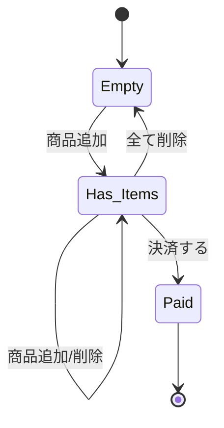

# Test Week 3②：ステータス管理の罠を潰す「状態遷移テスト」

前章のデシジョンテーブルは「その瞬間に入力されたフラグの組み合わせ（静的）」に対するバグを潰すものでした。
しかし、Webアプリや業務システムにおいて、プログラマーとユーザーを最も発狂させるバグは**「過去の経緯（履歴・ステータス）によって、今押せるボタンが変わる」**という【時間の流れ（動的）】に起因するバグです。

## 1. 状態（State）と遷移（Transition）の魔物

**【ネットスーパーのカート画面】** を想像してください。
この画面（システム）は、ユーザーの行動によって見えない「状態（ステータス：State）」が変化していきます。

1.  **[Empty]**: カートが空の状態。（『会計に進む』ボタンは押せないはず）
2.  **[Has Items]**: アイテムが入っている状態。（ここで『空にする』ボタンや『会計に進む』ボタンが押せる）
3.  **[Paid]**: 会計が完了した状態。（もうキャンセルはできない）

*   **[最悪のステータスバグの例]**:
    ユーザーが `[Paid(会計完了)]` の状態になった直後に、ブラウザの「戻る」ボタン等を駆使して、再び『会計に進む』のURL（API）を叩いてしまった場合。
    システムが「今、彼はお金払い終わってる状態だな」とチェックする機能（ガード条件）を書き忘れていると、**既に払ったのに再度クレジットカードを引き落とすという「二重決済の凶悪バグ」が発生します。**

## 2. 状態遷移テスト（State Transition Testing）

この「ありえない画面の移動（遷移）」のバグを、論理的に全て洗い出すテスト技法です。

### ① 状態遷移図 (State Transition Diagram) の作成
まずは丸と矢印で、システムが「今どの状態にいるか」と、「なんのボタン（イベント）が押されたら状態が変わるか」のマップ（フローチャートのようなもの）を描きます。（※ここでは文章で代替します）。

### ② 状態遷移表 (State Transition Table) への落とし込み
図を描いただけではテストはできません。これをExcelのマトリクス（表）にして、**「全状態」 × 「全ボタン（イベント）」の交差するマス目を全て埋めます。** これがプロのテスト技法です。

| 現在の[状態] (State) \ 引き金となる[イベント] (Event) | 商品を追加ボタン | 全て削除ボタン | 決済するボタン |
| :--- | :--- | :--- | :--- |
| **S1: [Empty]** (空っぽ) | ➡️ M1（S2へ遷移） | **🚨 無視（遷移不可）** | **🚨 エラー画面表示** |
| **S2: [Has_Items]** (アイテムあり) | ➡️ M2（S2のまま保留） | ➡️ M3（S1へ遷移） | ➡️ M4（S3へ遷移） |
| **S3: [Paid]** (決済完了) | **🚨 無視（遷移不可）** | **🚨 無視（遷移不可）** | **🚨 エラー画面表示（致命的）**|

> [!IMPORTANT]
> **🚀 ここで洗い出されるもの（N-Switch カバレッジ）**
> 
> *   **有効な遷移（0-Switchの保証）:**
>     表の中の「➡️」のマス（M1〜M4など）を順番に通るテスト（いわゆる正常なシナリオパス）を流して、正しく状態が変わるか確認します。
> *   **無効な遷移の発見（ここが究極のテストポイント！）:**
>     表の **「🚨 (エラー/無効)」** のマスに注目してください。これが【バグの震源地】です。
>     「決済完了（Paid）の状態で、決済するボタンを再度強制的に叩いてみた時、システムはクラッシュせず『決済済みです』と弾いて（ガードして）くれるか？」という、**不正な動作（Unhappy Path）による不正ステータスへの遷移防御テストを、論理的に漏れなく網羅**できるのです！
